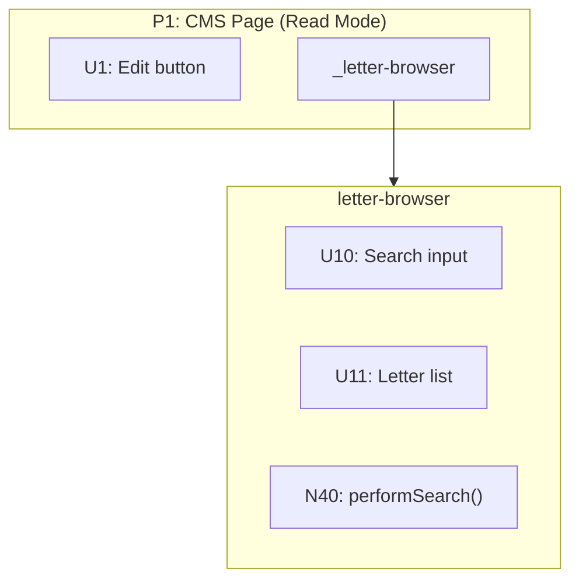
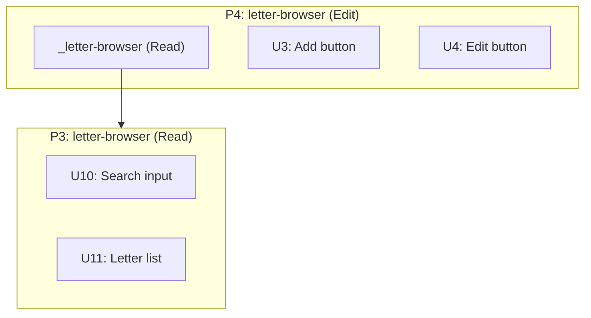
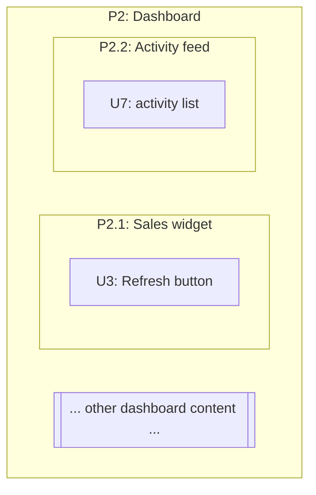

# Advanced Place Modeling

Detailed patterns for modeling complex place relationships in breadboards.

---

## Place IDs

Places are first-class elements in the data model. Each Place gets an ID:

| # | Place | Description |
|---|-------|-------------|
| P1 | CMS Page (Read Mode) | View-only state |
| P2 | CMS Page (Edit Mode) | Editing state with page-level controls |
| P2.1 | widget-grid (letters) | Subplace: letter editing widget within P2 |
| P3 | Letter Form Modal | Form for adding/editing letters |
| P4 | Backend | API resolvers and database |

Place IDs enable:
- **Explicit navigation wiring** — wire `→ P2` instead of to an affordance inside
- **Containment tracking** — each affordance declares which Place it belongs to
- **Consistent Mermaid subgraphs** — subgraph ID matches Place ID

## Place References

When a nested place has lots of internal affordances and would clutter the parent, **detach** it:

1. Put a **reference node** in the parent place using underscore prefix: `_letter-browser`
2. Define the full place separately with all its internals
3. Wire from the reference to the place: `_letter-browser --> letter-browser`

The reference is a **UI affordance** — it represents "this widget/component renders here" in the parent context.



In affordance tables, list the reference as a UI affordance:

| # | Affordance | Control | Wires Out |
|---|------------|---------|-----------|
| U1 | Edit button | click | → N1 |
| _letter-browser | Widget reference | — | → P3 |

Style place references with a dashed border to distinguish them:
```
classDef placeRef fill:#ffb6c1,stroke:#d87093,stroke-width:2px,stroke-dasharray:5 5
class U_LB placeRef
```

## Modes as Places

When a component has distinct modes (read vs edit, viewing vs editing, collapsed vs expanded), model them as **separate places** — they represent different perceptual states for the user.

If one mode includes everything from another plus more, show this with a **place reference** inside the extended place:

```
P3: letter-browser (Read)    — base state
P4: letter-browser (Edit)    — contains _letter-browser (Read) + new affordances
```

The reference shows composition: "everything in P3 appears here, plus these additions."



In affordance tables for P4, the reference shows inheritance:

| # | Affordance | Control | Wires Out | Notes |
|---|------------|---------|-----------|-------|
| _letter-browser (Read) | Inherits all of P3 | — | → P3 | |
| U3 | Add button | click | → N3 | NEW |
| U4 | Edit button | click | → N4 | NEW |

## Subplaces

A **subplace** is a defined subset of a Place — a contained area that groups related affordances. Use subplaces when:
- A Place contains multiple distinct widgets or sections
- Detailing one part of a larger Place
- Showing what is in scope vs out of scope

**Notation:** Use hierarchical IDs — `P2.1`, `P2.2`, etc. for subplaces of P2.

```
| # | Place | Description |
|---|-------|-------------|
| P2 | Dashboard | Main dashboard page |
| P2.1 | Sales widget | Subplace: sales metrics |
| P2.2 | Activity feed | Subplace: recent activity |
```

In affordance tables, use the subplace ID to show containment:

```
| U3 | P2.1 | sales-widget | "Refresh" button | click | → N4 | — |
| U7 | P2.2 | activity-feed | activity list | render | — | — |
```

**In Mermaid:** Nest the subplace subgraph inside the parent. Use the same background color (no distinct fill) — the subplace is part of the parent, not a separate Place:



**Placeholder for out-of-scope content:** When detailing one subplace, add a placeholder sibling to show there is more on the page:

```
otherContent[["... other page content ..."]]
```

This tells readers: "this breadboard zooms in on P2.1, but P2 contains more that is not being detailed."

## Navigation Wiring

When an affordance causes navigation (user "goes" somewhere), wire to the **Place itself**, not to an affordance inside:

```
✅ N1 Wires Out: → P2          (navigate to Edit Mode)
❌ N1 Wires Out: → U3          (wiring to affordance inside P2)
```

This makes navigation explicit in the tables. The Place is the destination; specific affordances inside become available once the user arrives.

In Mermaid, this becomes:
```
N1 --> P2
```

The subgraph ID matches the Place ID, so the wire connects to the Place boundary.
