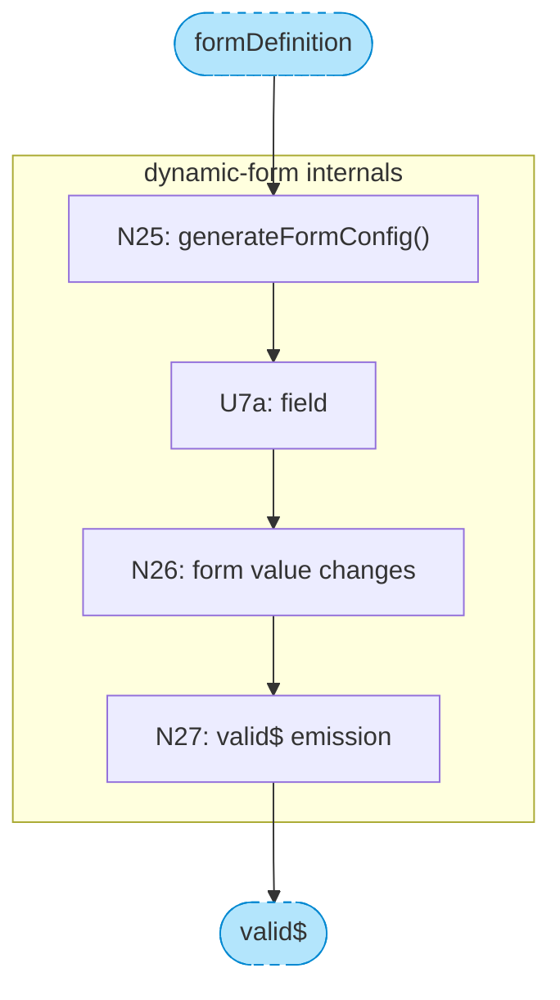

# Catalog of Parts and Relationships

Complete reference of everything that can appear in a breadboard.

---

## Elements

| Element | ID Pattern | What It Is | What Qualifies |
|---------|------------|------------|----------------|
| **Place** | P1, P2, P3... | A bounded context of interaction | Blocking test: can't interact with what's behind |
| **Subplace** | P2.1, P2.2... | A defined subset within a Place | Groups related affordances within a larger Place |
| **Place Reference** | _PlaceName | UI affordance pointing to a detached place | Complex nested place defined separately |
| **UI Affordance** | U1, U2, U3... | Something the user can see or interact with | Inputs, buttons, displays, scroll regions |
| **Code Affordance** | N1, N2, N3... | Something in code that can be acted upon | Methods, subscriptions, handlers, framework mechanisms |
| **Data Store** | S1, S2, S3... | State that persists and is read/written | Properties, arrays, observables that hold data |
| **Chunk** | — | A collapsed subsystem | One wire in, one wire out, many internals |
| **Placeholder** | — | Out-of-scope content marker | Shows context without detailing |

## Relationships

| Relationship | Syntax | Meaning | Example |
|--------------|--------|---------|---------|
| **Containment** | Place column | Affordance belongs to Place | `U3` in Place `P2.1` |
| **Wires Out** | `→ X` | Control flow: triggers/calls | `→ N4`, `→ P2` |
| **Returns To** | `→ X` (in Returns To column) | Data flow: output goes to | `→ U6`, `→ N3` |
| **Abbreviated flow** | `\|label\|` | Intermediate steps omitted | `S4 -.-> \|view query\| U6` |
| **Parent-child** | Hierarchical ID | Subplace belongs to Place | P2.1 is child of P2 |

## What Qualifies as Each Element

**Place (P):**
- Passes the blocking test — can't interact with what's behind
- Examples: modal, edit mode (whole screen transforms), route/page
- Not: dropdown, tooltip, checkbox revealing fields

**Place Reference (_PlaceName):**
- A UI affordance that represents a detached place
- Use when a nested place has many affordances and would clutter the parent
- Examples: `_letter-browser`, `_user-profile-widget`
- Wires to the full place definition: `_letter-browser --> P3`

**UI Affordance (U):**
- User can see it or interact with it
- Examples: button, input, list, spinner, displayed text
- Not: wrapper elements, layout containers

**Code Affordance (N):**
- Has meaningful identity — can be pointed to in code
- Examples: `handleSubmit()`, `query$ subscription`, `detectChanges()`
- Not: internal transforms, navigation mechanisms

**Data Store (S):**
- State that is written and read
- Examples: `results` array, `loading` boolean, `changedPosts` list
- External stores: `Browser URL`, `localStorage`, `Clipboard` — represent state outside the app boundary
- Not: config that is set once and never changes

## Verification Checks

| Check | Question | If No... |
|-------|----------|----------|
| **Every U that displays data** | Does it have an incoming wire (via Wires Out or Returns To)? | Add the data source |
| **Every N** | Does it have Wires Out or Returns To (or both)? | Investigate — may be dead code or missing wiring |
| **Every S** | Does something read from it (Returns To)? | Investigate — may be unused |
| **Navigation mechanisms** | Is this N just the "how" of getting somewhere? | Wire directly to Place instead |
| **N with side effects** | Does this N affect external state (URL, storage, clipboard)? | Add a store for the external state |

## Chunking

Chunking collapses a subsystem into a single node in the main diagram, with details shown separately. Use chunking to manage complexity when a section of the breadboard has:

- **One wire in** (single entry point)
- **One wire out** (single output)
- **Lots of internals** between them

### When to Chunk

Look for sections where tracing the wiring reveals a "pinch point" — many affordances that funnel through a single input and single output. These are natural boundaries for chunking.

Example: A `dynamic-form` component receives a form definition, renders many fields (U7a-U7k), validates on change (N26), and emits a single `valid$` signal. In the main diagram, this becomes:

```
N24 -->|formDefinition| dynamicForm
dynamicForm -.->|valid$| U8
```

### How to Chunk

1. **In the main diagram**, replace the subsystem with a single stadium-shaped node:

```
dynamicForm[["CHUNK: dynamic-form"]]
```

2. **Wire to/from the chunk** using the boundary signals:

```
N24 -->|formDefinition| dynamicForm
dynamicForm -.->|valid$| U8
```

3. **Create a separate chunk diagram** showing the internals with boundary markers:



4. **Style chunks distinctly** in the main diagram:

```
classDef chunk fill:#b3e5fc,stroke:#0288d1,color:#000,stroke-width:2px
class dynamicForm chunk
```

### Chunk Color Convention

| Type | Color | Hex |
|------|-------|-----|
| Chunk node (main diagram) | Light blue | `#b3e5fc` |
| Boundary markers (chunk diagram) | Light blue, dashed | `#b3e5fc` with `stroke-dasharray:5 5` |
