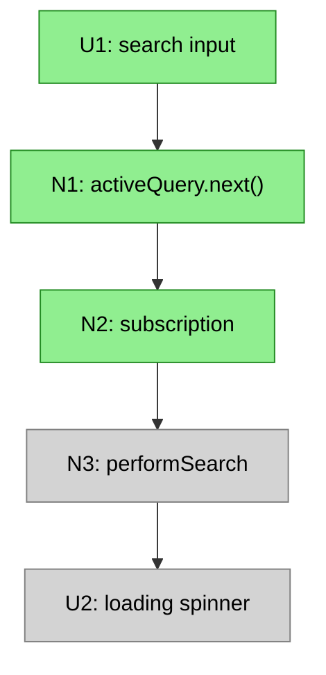

# Slicing a Breadboard

Slicing takes a breadboard and groups its affordances into **vertical implementation slices**.

**Input:**
- Breadboard (affordance tables with wiring)
- Shape (R + mechanisms) — guides what demos matter

**Output:**
- Breadboard with affordances assigned to slices V1–V9 (max 9 slices)

---

## What Is a Vertical Slice?

A vertical slice is a group of UI and Code affordances that does something demo-able. It cuts through all layers (UI, logic, data) to deliver a working increment.

The opposite is a horizontal slice — doing work on one layer (e.g., "set up all the data models") that is not clickable from the interface.

## The Key Constraint

**Every slice must have visible UI that can be demoed.** A slice without UI is a horizontal layer, not a vertical slice.

- V "Self-serve Signing Path" (demo: checkout → sign → see signature)
- X "Database Schema" (no demo possible)

**Demo-able means:**
- Has an entry point (UI interaction or trigger)
- Has an observable output (UI renders, effect occurs)
- Shows meaningful progress toward the R

The shape guides what counts as "meaningful progress" — affordances are not grouped arbitrarily, but to demonstrate mechanisms working.

## Slice Size

- **Too small:** Only 1-2 UI affordances, no meaningful demo → merge with related slice
- **Too big:** 15+ affordances or multiple unrelated journeys → split
- **Right size:** A coherent journey with a clear "watch me do this" demo

Aim for 9 or fewer slices. If more are needed, the shape may be too large for one cycle.

## Wires to Future Slices

A slice may contain affordances with Wires Out pointing to affordances in later slices. These wires exist in the breadboard but are not implemented yet — they are stubs or no-ops until that later slice is built.

This is normal. The breadboard shows the complete system; slicing shows the order of implementation.

## Procedure

**Step 1: Identify the minimal demo-able increment**

Look at the breadboard and shape. Ask: "What is the smallest subset that demonstrates the core mechanism working?"

Usually this is:
- The core data fetch
- Basic rendering
- No search, no pagination, no state persistence yet

This becomes V1.

**Step 2: Layer additional capabilities as slices**

Look at the mechanisms in the shape. Each slice should demonstrate a mechanism working:
- V2: Search input (demonstrates the search mechanism)
- V3: Pagination/infinite scroll (demonstrates the pagination mechanism)
- V4: URL state persistence (demonstrates the state preservation mechanism)
- etc.

**Max 9 slices.** If there are more, combine related mechanisms. Features that do not make sense alone should be in the same slice.

**Step 3: Assign affordances to slices**

Go through every affordance and assign it to the slice where it is first needed to demo that slice's mechanism:

| Slice | Mechanism | Affordances |
|-------|-----------|-------------|
| V1 | Core display | U2, U3, N3, N4, N5, N6, N7 |
| V2 | Search | U1, N1, N2 |
| V3 | Pagination | U10, N11, N12, N13 |

Some affordances may have Wires Out to later slices — that is fine. They are implemented in their assigned slice; the wires just do not do anything yet.

**Step 4: Create per-slice affordance tables**

For each slice, extract just the affordances being added:

**V2: Search Works**

| # | Component | Affordance | Control | Wires Out | Returns To |
|---|-----------|------------|---------|-----------|------------|
| U1 | search-detail | search input | type | → N1 | — |
| N1 | search-detail | `activeQuery.next()` | call | → N2 | — |
| N2 | search-detail | `activeQuery` subscription | observe | → N3 | — |

**Step 5: Write a demo statement for each slice**

Each slice needs a concrete demo that shows its mechanism working toward the R:
- V1: "Widget shows real data from the API"
- V2: "Type 'dharma', results filter live"
- V3: "Scroll down, more items load"

The demo should be something that can be shown to a stakeholder to demonstrate progress.

## Visualizing Slices in Mermaid

Show the complete breadboard in every slice diagram, but use styling to distinguish scope:

| Category | Style | Description |
|----------|-------|-------------|
| **This slice** | Bright color | Affordances being added |
| **Already built** | Solid grey | Previous slices |
| **Future** | Transparent, dashed border | Not yet built |

This lets stakeholders see:
- What is being built now (highlighted)
- What already exists (grey)
- What is coming later (faded)

## Slice Summary Format

| # | Slice | Mechanism | Demo |
|---|-------|-----------|------|
| V1 | Widget with real data | F1, F4, F6 | "Widget shows letters from API" |
| V2 | Search works | F3 | "Type to filter results" |
| V3 | Infinite scroll | F5 | "Scroll down, more load" |
| V4 | URL state | F2 | "Refresh preserves search" |

The Mechanism column references parts from the shape, showing which mechanisms each slice demonstrates.
