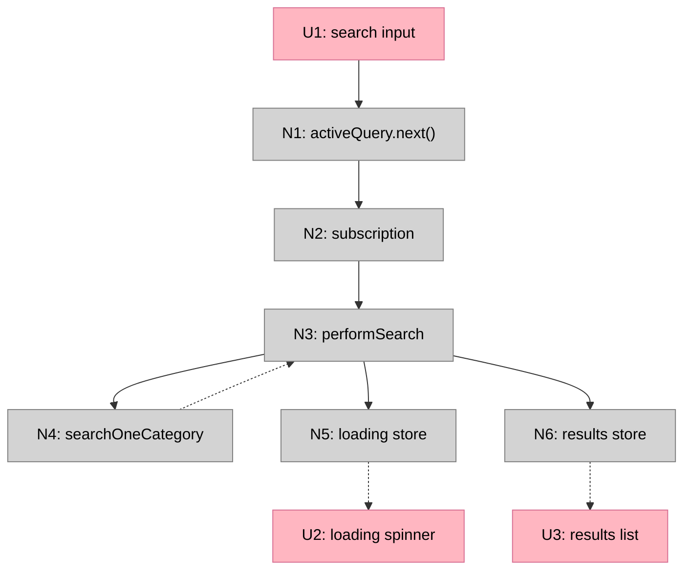
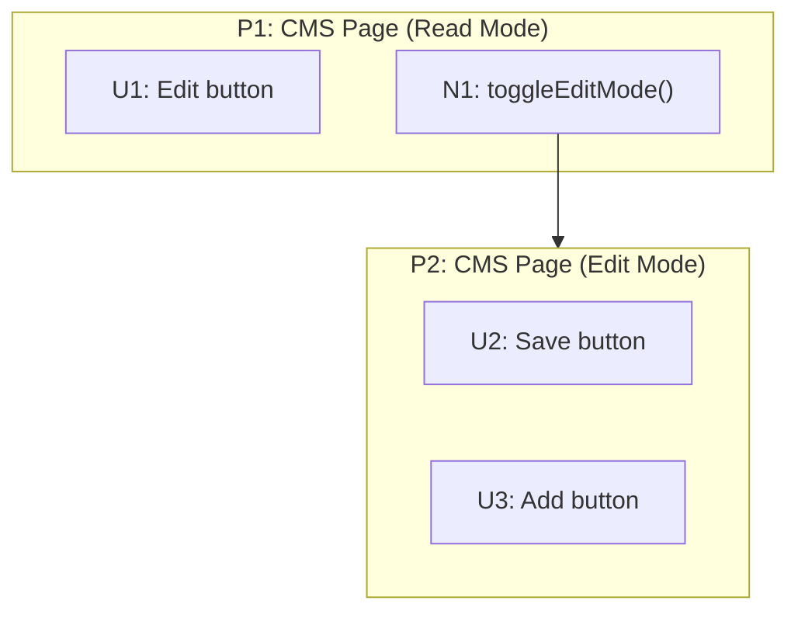
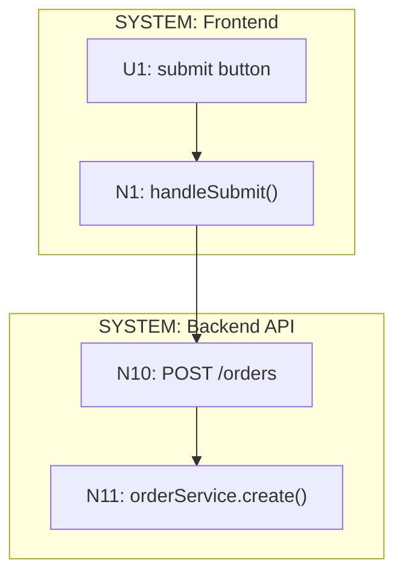
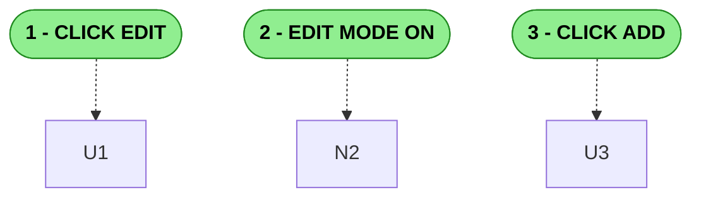

# Mermaid Visualization

The tables are the truth. Mermaid diagrams are optional visualizations for humans.

---

## Basic Structure



## Line Conventions

| Line Style | Mermaid Syntax | Use |
|------------|----------------|-----|
| Solid (`-->`) | `A --> B` | Wires Out: calls, triggers, writes |
| Dashed (`-.->`) | `A -.-> B` | Returns To: return values, data store reads |
| Labeled `...` | `A -.->|...| B` | Abbreviated flow: intermediate steps omitted |

### Abbreviating Out-of-Scope Flows

When a data flow has intermediate steps that are not relevant to the breadboard's scope, abbreviate by wiring directly from source to destination with a `...` label:

```
S4 -.->|...| U6
```

This says "data flows from S4 to U6, with intermediate steps omitted." Use this when:
- The flow exists but its internals are out of scope
- Showing where data originates without detailing the query chain
- The breadboard focuses on one workflow (e.g., editing) but needs to acknowledge another (e.g., viewing)

## ID Prefixes

| Prefix | Type | Example |
|--------|------|---------|
| **P** | Places | P1, P2, P3 |
| **U** | UI affordances | U1, U2, U3 |
| **N** | Code affordances | N1, N2, N3 |
| **S** | Data stores | S1, S2, S3 |

## Color Conventions

| Type | Color | Hex |
|------|-------|-----|
| Places (subgraphs) | White/transparent | — |
| UI affordances | Pink | `#ffb6c1` |
| Code affordances | Grey | `#d3d3d3` |
| Data stores | Lavender | `#e6e6fa` |
| Chunks | Light blue | `#b3e5fc` |
| Place references | Pink, dashed border | `#ffb6c1` |

```
classDef ui fill:#ffb6c1,stroke:#d87093,color:#000
classDef nonui fill:#d3d3d3,stroke:#808080,color:#000
classDef store fill:#e6e6fa,stroke:#9370db,color:#000
classDef chunk fill:#b3e5fc,stroke:#0288d1,color:#000,stroke-width:2px
classDef placeRef fill:#ffb6c1,stroke:#d87093,stroke-width:2px,stroke-dasharray:5 5
```

## Subgraph Labels and Place IDs

Use the Place ID as the subgraph ID so navigation wiring connects properly:



| Type | ID Pattern | Label Pattern | Purpose |
|------|------------|---------------|---------|
| Place | `P1`, `P2`... | `P1: Page Name` | A bounded context the user visits |
| Trigger | — | `TRIGGER: Name` | An event that kicks off a flow (not navigable) |
| Component | — | `COMPONENT: Name` | Reusable UI+logic that appears in multiple places |
| System | — | `SYSTEM: Name` | When spanning multiple applications |

**Key point:** The subgraph ID (`P1`, `P2`) must match the Place ID from the Places table. This allows navigation wires like `N1 --> P2` to connect to the Place boundary.

## When Spanning Multiple Systems



## Workflow Step Annotations (Optional)

When breadboarding a specific workflow, optionally add numbered step markers to help readers follow the sequence visually. This is useful when:
- The diagram is complex and the workflow path is not obvious
- Guiding someone through a specific user journey
- The breadboard will be used as a walkthrough or teaching tool

**Format:**

Add a Workflow Guide table before the diagram:

```markdown
| Step | Action | Where to look |
|------|--------|---------------|
| **1** | Click "Edit" button | U1 → N1 → S1 |
| **2** | Edit mode activates | S1 → N2 → U3 |
| **3** | Click "Add" | U3 → N3 → N8 |
```

Add step marker nodes in the Mermaid diagram using stadium-shaped nodes:



**Formatting notes:**
- Use `"1 - ACTION"` format (number, space, hyphen, space, action)
- Avoid `"1. ACTION"` — the period triggers Mermaid's markdown list parser
- Avoid `"1) ACTION"` — parentheses can also cause parsing issues
- Connect step markers to affordances with dashed lines (`-.->`)
- Style steps green to distinguish from UI (pink) and Code (grey) affordances
